# AI MedStudio – Architektura systému

## 1. Přehled a architektonický koncept

AI MedStudio je medicínská studijní platforma postavená na modulární vícevrstvé architektuře.
Backend je implementován ve **FastAPI** (Python 3.12+), frontend je moderní SPA servírovaná přes statické soubory s podporou SSE (Server-Sent Events) pro živé streamování logů a chatových odpovědí.

Aplikace funguje v modelu **BYOK (Bring Your Own Key)** – veškerá uživatelská data a indexy zůstávají uloženy lokálně.

---

## 2. Diagram architektury a toku dat

```mermaid
flowchart TD
    Client["Klientská SPA aplikace (Web / Desktop App)"]
    
    subgraph FastAPI_Layer ["FastAPI Aplikační vrstva (main.py)"]
        AuthMiddleware["Auth Middleware (RBAC, Sessions, Cookies)"]
        StaticMounts["Static File Mounts (/uploads, /audio, /notes, /static)"]
        
        subgraph Routers ["Modulární HTTP Routery (routers/)"]
            R_Auth["routers/auth.py"]
            R_Projects["routers/projects.py"]
            R_Files["routers/files.py"]
            R_Podcast["routers/podcast.py"]
            R_Notes["routers/notes.py"]
            R_Cards["routers/flashcards.py"]
            R_Batch["routers/batch.py"]
            R_Chat["routers/chat_api.py"]
            R_Medulingo["routers/medulingo.py"]
            R_Tests["routers/tests_api.py"]
            R_Settings["routers/settings.py"]
            R_Print["routers/print.py"]
        end
    end

    subgraph Domain_Services ["Business Doménové Služby (services/)"]
        S_AI["services/ai_service.py (Resilience, Retry, JSON Parser)"]
        S_RAG["services/rag_service.py (ChromaDB, Hybrid Retrieval, Chunking)"]
        S_Notes["services/notes_service.py (Markdown Synthesis, Citace)"]
        S_Cards["services/flashcards_service.py (Anki/Quizlet Engine)"]
        S_Podcast["services/podcast_service.py (TTS Syntéza, Subtitles, MP4)"]
        S_Auth["services/auth_service.py (PBKDF2, SQLite User Store)"]
        S_Chat["services/chat_service.py (Grounded Chat, FTS5 Search)"]
        S_Lesson["services/lesson_service.py (Dvoufázová výuka)"]
        S_Test["services/test_service.py (Psychometrické SBA/MCQ)"]
        S_Medulingo["services/medulingo_service.py (Pacing, Streaks)"]
    end

    subgraph Core_Infra ["Infrastrukturní Jádro (core/)"]
        C_Config["core/config.py"]
        C_Clients["core/clients.py"]
        C_Security["core/security.py (safe_join, safe_filename)"]
        C_Logger["core/logger.py (SSE, Batch Events)"]
        C_Utils["core/utils.py"]
        C_Context["core/context.py"]
    end

    subgraph Prompts_Layer ["Izolované Šablony Promptů (prompts/)"]
        P_Notes["prompts/notes.py"]
        P_Cards["prompts/flashcards.py"]
        P_Podcast["prompts/podcast.py"]
        P_Chat["prompts/chat.py"]
        P_Lesson["prompts/lesson.py"]
        P_Test["prompts/test.py"]
        P_Medulingo["prompts/medulingo.py"]
    end

    subgraph External_Storage ["Lokální Úložiště & Externí Poskytovatelé"]
        DB_Auth[("SQLite: auth.db")]
        DB_Chat[("SQLite: chat_history.db")]
        DB_Chroma[("ChromaDB: Vektory")]
        FS_Storage[("Filesystem: uploads/, audio/, notes/, tests/")]
        API_Gemini["Google Gemini API"]
        API_OpenAI["OpenAI API (TTS)"]
        API_Eleven["ElevenLabs API (TTS)"]
    end

    Client --> AuthMiddleware
    AuthMiddleware --> Routers
    Routers --> Domain_Services
    Domain_Services --> Core_Infra
    Domain_Services --> Prompts_Layer
    Domain_Services --> External_Storage
    Core_Infra --> External_Storage
```



---

## 3. Popis modulů a vrstev

### 3.1. Orchestrace aplikace (`main.py`)
Hlavní soubor aplikace byl refaktorován z původního 3 550 řádkového monolitu na štíhlý orchestrátor (~300 řádků):
- Inicializace FastAPI s konfigurací CORS a lifespan.
- **`auth_middleware`**: globální zachytávání požadavků, extrakce session tokenu z HTTP-only cookies nebo `Authorization: Bearer`, přiřazení rolí (`admin`, `user`, `viewer`), přepínání jazykového kontextu.
- Mapování statických složek a registrace 12 dedikovaných routerů.

### 3.2. HTTP vrstva (`routers/`)
Každá doménová oblast má samostatný APIRouter:
- **`projects.py`**: Správa projektů (CRUD, přejmenování, vyčištění, zip export s metadaty, bezpečný import, statistiky `/api/stats`).
- **`files.py`**: Nahrávání podkladů (PDF, DOCX, PPTX, TXT), bezpečné zobrazení a preview, reindexace do ChromaDB.
- **`podcast.py`**: Generování scénářů, syntéza audia, titulkování (SRT/MP4), správa výstupních souborů.
- **`notes.py`**: Generování strukturovaných studijních textů s horními indexy citací, mazání a zobrazení poznámek.
- **`flashcards.py`**: Generování kartiček, předvolby promptů, export pro Anki (TSV/HTML) a Quizlet.
- **`batch.py`**: Správa asynchronních dávek na pozadí, cancellation tokeny, noční režim pro podcasty, poznámky i kartičky.
- **`chat_api.py`**: Interaktivní ukotvený asistent (Grounded Chat), vlákna konverzací, připínání a export do Markdownu.
- **`medulingo.py`**: Gamifikovaná výuková stezka otázek, 5fázový balíček pro každou otázku.
- **`tests_api.py`**: Cvičné testy (SBA, MCQ, otevřené otázky), vyhodnocení odpovědí, adaptivní generování dalších otázek.
- **`auth.py`**: Přihlášení, odhlášení, registrace, administrace uživatelů a stav systému.
- **`settings.py`**: Správa BYOK klíčů, testování připojení k poskytovatelům v reálném čase.
- **`print.py`**: Tiskové šablony a náhledy pro tisk do PDF.

### 3.3. Doménové služby (`services/`)
Čistá business logika bez závislosti na `main.py`, což zcela eliminuje kruhové závislosti:
- **`ai_service.py`**: Jednotný wrapper pro volání Gemini API s exponenciálním backoffem, fallback modely (`gemini-3.6-flash` -> `gemini-flash-latest`), parsování JSON s markdown sanitizací (`clean_and_parse_json`).
- **`rag_service.py`**: RAG pipeline – extrakce sekcí z PDF/DOCX/PPTX, sémantické chunkování se zachováním stran, hybridní vyhledávání v ChromaDB.
- **`notes_service.py`**: Syntéza poznámek a sanitizace markdown tabulek.
- **`flashcards_service.py`**: Extrakce faktů, párování citací ke konkrétním stranám dokumentů, formátovače Anki TSV a Quizlet textu.
- **`podcast_service.py`**: Generování skriptu, integrace OpenAI TTS a ElevenLabs TTS, tvorba titulků přes FFmpeg.
- **`auth_service.py`**: Správa uživatelů, PBKDF2 hashování, transakční bezpečnost v SQLite (WAL režim).
- **`chat_service.py`**: Perzistence chatových zpráv, SQLite FTS5 fulltext indexace.
- **`lesson_service.py`**: Multimodální syntéza komplexní výukové lekce (studijní text + audio přednáška s kapitolami).
- **`test_service.py`**: Generování psychometrických testů, Jaccard/Dice evaluace otevřených odpovědí.
- **`medulingo_service.py`**: Algoritmus plánování přípravy na zkoušku, denní cíle a streak tracking.

### 3.4. Sdílené jádro (`core/`)
- **`security.py`**: `safe_join` a `safe_filename` pro prevenci Path Traversal útoků (CWE-22).
- **`config.py`**: Detekce prostředí (Docker, dev, PyInstaller), bezpečné cesty k datovým adresářům, BYOK konfigurace.
- **`clients.py`**: Inicializace klientů (Gemini, OpenAI, ChromaDB) se singleton cachingem.
- **`logger.py`**: SSE vysílání událostí, kruhový buffer zpráv pro nově připojené klienty.
- **`utils.py`**: Sanitizace řetězců, formátování chybových hlášení.
- **`context.py`**: ContextVars pro bezpečné předávání přihlášeného uživatele a jazyka napříč asynchronním stackem.

### 3.5. Správa promptů (`prompts/`)
Všechny systémové instrukce a šablony promptů jsou vyčleněny do samostatných souborů podle domén (`notes.py`, `flashcards.py`, `podcast.py`, `chat.py`, `lesson.py`, `test.py`, `medulingo.py`). Žádné prompty nejsou natvrdo vepsány v aplikační logice.

---

## 4. Bezpečnostní architektura

1. **Ochrana souborového systému (CWE-22 Path Traversal):**
   Všechny operace s filesystemem (`/api/files/*`, `/api/outputs/*`, `/api/notes/*`, `/api/flashcards/*`) prochází přes `safe_join()`, který ověřuje, že cílová absolutní cesta neopouští vyhrazený kořenový adresář projektu.
2. **Řízení přístupu (RBAC):**
   - `admin`: plný přístup ke konfiguraci, správě uživatelů a všem projektům.
   - `user`: práce s vlastními projekty a materiály.
   - `viewer` (včetně režimu neověřeného hosta): striktně pouze read-only procházení hotových materiálů; jakákoliv mutující metoda (`POST`, `PUT`, `DELETE`) mimo přihlášení a přípravu tisku je zablokována s kódem `403 Forbidden`.
3. **Izolace tajemství a dat v Dockeru:**
   Soubor `.dockerignore` striktně filtruje veškeré SQLite databáze (`auth.db*`, `*.db*`), soubory proměnných prostředí (`.env*`, `.deploy.env`) a záložní soubory, čímž brání úniku přihlašovacích údajů při sestavování kontejneru.
4. **Veřejná whitelist zóna:**
   Auth middleware explicitně propouští pouze nutné veřejné cesty (`/health`, `/manifest.json`, `/icon.svg`, `/favicon.ico`, `/css/*`, `/js/*`, `/static/*`, `/api/auth/*`), čímž zamezuje nechtěnému zamykání UI.

---

## 5. Testovací strategie

Projekt obsahuje sadu automatizovaných testů umístěných v adresáři `tests/`:
- **`test_security.py`**: ověřuje prevenci Path Traversal, chování `safe_join`, sanitizaci názvů souborů a správné reakce Auth Middleware.
- **`test_services.py`**: testuje odolnost parseru JSON (`clean_and_parse_json`), fallback mechanizmy Gemini modelů, sanitizaci tabulek a párování zdrojů kartiček.
- **`test_api_integrity.py`**: integrační smoke test ověřující registraci všech 79 OpenAPI operací napříč routery a funkčnost `/health`.

Spuštění testů:
```bash
./venv/bin/python -m unittest discover tests
```
